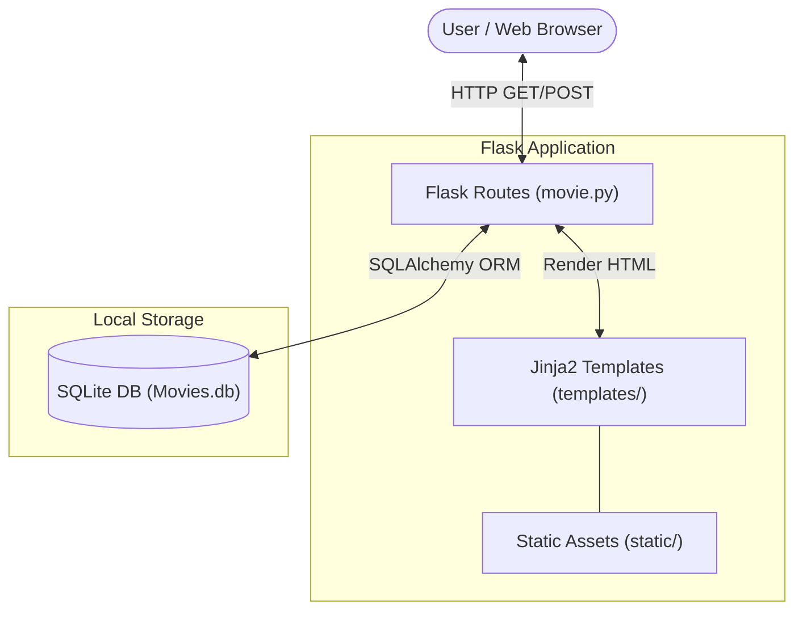

---

  

---

**A simple web application written in Python using Flask and SQLAlchemy** to demonstrate Create, Read, Update, and Delete (CRUD) operations on a **SQLite** database.

It is designed as a lightweight demonstration of routing, templates, and Object-Relational Mapping (ORM) using the Flask web framework.

## Use Case
This application is designed for basic web application demonstrations and learning. By providing a fully functional MVC-like structure with basic database interactions, it serves as an excellent starting point for building small-scale applications or understanding web framework foundations in Python.

## Minimum Requirements
To build and execute this project, the following minimum requirements must be met:
- **Python:** `3.8` or higher
- **Package Manager:** `pip` for installing the required dependencies

## Architecture


| Component | Type | Use Case |
| :--- | :--- | :--- |
| **Frontend** | Jinja2 Templates + Static Assets | Renders the HTML interface for users to interact with movies. |
| **Backend** | Flask | Handles the web API endpoints (`/`, `/update`, `/delete`) and core logic. |
| **Database** | SQLite + SQLAlchemy ORM | Local, file-based database handling the persistent storage of movie titles. |

## Tech Stack
- **Backend Framework:** Python, Flask
- **Database & ORM:** SQLite, SQLAlchemy (via Flask-SQLAlchemy)
- **Testing & Security Tooling:** pytest, bandit, safety, python-taint, pylint

## Features
- **Create:** Add new movies to the database via frontend form submission.
- **Read:** Display all added movies on the main page dynamically.
- **Update:** Modify the title of an existing movie.
- **Delete:** Remove a movie from the database.
- **Code Quality:** Configured with several linters, security scanners (`bandit`), and test runners natively.

## Project Structure
```text
.
├── movie.py                    # Main Flask application file and DB models
├── tests/
│   └── test_basic.py           # Unit tests using pytest
├── templates/                  # Directory for Jinja2 HTML templates
├── static/                     # Directory for static files (CSS, JS)
├── requirements.txt            # Python dependencies lists
├── run_bandit.py               # Helper script to run bandit security tests
├── bandit.ignore               # Bandit exclusions configurations
├── sonar-project.properties    # SonarQube static code analysis properties
└── README.md                   # Project documentation
```

## Step-by-Step Execution Guide
Follow these steps precisely to locally deploy and run the application:

### 1. Clone the Repository
Open your terminal and clone the repository, then navigate into the project directory:
```bash
git clone <repository-url>
cd movie-crud-flask
```

### 2. Create a Virtual Environment (Optional but Recommended)
Ensure you isolate your dependencies:
```bash
python3 -m venv venv
source venv/bin/activate
```

### 3. Install Dependencies
Install all the required Python packages defined in the requirements file:
```bash
pip install -r requirements.txt
```

### 4. Run the Application
Start the Flask development server:
```bash
python movie.py
```
*Depending on the configuration, you should be able to access the app at `http://127.0.0.1:5000/` or `http://0.0.0.0:5000/`.*

## Testing & Troubleshooting
To verify the application mechanics:
1. Open a browser and access the host URL. Add a new movie and verify it appears.
2. Attempt to Edit and Delete that entry.
3. **Unit Tests:** Validate application logic by running `pytest test_basic.py`.
4. **Security Tests:** Inspect the codebase by running `python run_bandit.py`.

## Cleanup Procedures
To shut down the app, use `Ctrl+C` in the running terminal. 
To clear database state, safely delete the `Movies.db` SQLite file:
```bash
rm Movies.db
```
To exit the virtual environment, simply run:
```bash
deactivate
```

---

**Manish Pandey** — Senior DevOps/Platform Engineer

### 🛠️ Technology Stack
#### ☁️ Cloud & Platforms


#### ⚙️ Platform & DevOps


#### 🔐 Security & Ops


#### 🧑‍💻 Programming


#### 💾 Database


### Connect With Me
- **GitHub:** [@mpandey95](https://github.com/mpandey95)
- **LinkedIn:** [manish-pandey95](https://linkedin.com/in/manish-pandey95)
- **Email:** <mnshkmrpnd@gmail.com>

### License
See **LICENSE** | Support: [GitHub](https://github.com/mpandey95) • [LinkedIn](https://linkedin.com/in/manish-pandey95)